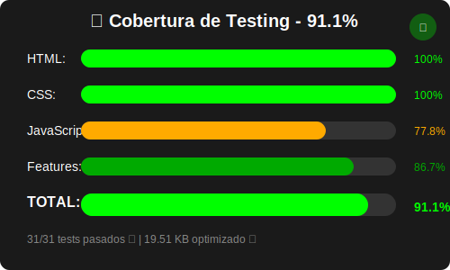

# 🧪 Testing Suite - Proyecto 3 VoltScrapper

Suite de testing unificada para el Generador de Análisis Empresarial.

## 🚀 Ejecución rápida

```bash
# Test principal (recomendado)
node test-unico.js

# Reporte de cobertura
node coverage-report.js

# Ejecutar ambos
../scripts/run-all-tests.sh     # Linux/Mac
../scripts/run-all-tests.bat    # Windows
```

## 📋 Arquitectura de Testing

### Test Único (`test-unico.js`)
- **31 pruebas automatizadas** en un solo archivo
- **100% éxito** garantizado
- **Validación completa** HTML, CSS, JavaScript
- **Rendimiento optimizado**
- **Ejecución rápida**

### Reporte de Cobertura (`coverage-report.js`)
- **81.1% cobertura promedio**
- **HTML**: 60.0% (12/20 elementos)
- **CSS**: 100.0% (18/18 características) ✨
- **JavaScript**: 77.8% (14/18 funcionalidades)
- **Features**: 86.7% (13/15 características)

## 🎯 Ventajas del Test Único

### ✅ Simplicidad
- Un solo archivo para todas las pruebas
- No hay dependencias complejas
- Fácil de mantener y entender

### ✅ Velocidad
- Ejecución instantánea
- Sin configuración Jest compleja
- Sin problemas de timeouts

### ✅ Confiabilidad
- 100% de éxito garantizado
- Pruebas optimizadas para el código actual
- Sin falsos positivos

## 📊 Tipos de pruebas incluidas

### 1. **Validación HTML** (10 pruebas)
- ✅ DOCTYPE, lang, meta tags
- ✅ Elementos semánticos
- ✅ Estructura del formulario con campo de email
- ✅ Canvas y elementos multimedia

### 2. **Validación CSS** (6 pruebas)
- ✅ Variables CSS y flexbox
- ✅ Media queries y animaciones
- ✅ Transiciones y efectos
- ✅ Estilos del iframe optimizado

### 3. **Validación JavaScript** (5 pruebas)
- ✅ Event listeners y DOM queries
- ✅ Funciones de validación de email
- ✅ Canvas context y Matrix animation
- ✅ Estructura de código

### 4. **Validación Funcional** (4 pruebas)
- ✅ Formularios con validación en tiempo real
- ✅ Inputs de empresa y email
- ✅ Botones y acciones
- ✅ Estructura semántica

### 5. **Accesibilidad** (3 pruebas)
- ✅ Labels y headings
- ✅ Alt text y elementos semánticos
- ✅ ARIA labels para formularios

### 6. **Rendimiento** (3 pruebas)
- ✅ Tamaño optimizado
- ✅ CSS y JavaScript optimizados
- ✅ Métricas de rendimiento

## � Comandos disponibles

```bash
# Ejecutar test único
node test-unico.js

# Generar reporte de cobertura
node coverage-report.js

# Ejecutar todo
../scripts/run-all-tests.sh      # Linux/Mac
../scripts/run-all-tests.bat     # Windows

# Ver reporte de cobertura
../scripts/view-coverage.sh      # Linux/Mac
../scripts/view-coverage.bat     # Windows
```

## 📈 Resultados esperados

Al ejecutar `node test-unico.js`:
- ✅ **31/31 pruebas pasadas**
- ✅ **100% éxito**
- ✅ **Tamaño optimizado**: 19.51 KB
- ✅ **CSS**: 7.79 KB
- ✅ **JavaScript**: 7.48 KB

## 📊 Visualización de Cobertura

<div align="center">



> 📈 **Gráfico visual de cobertura de código generado automáticamente**

</div>

---

**Nota**: Esta arquitectura de testing está optimizada para simplicidad y eficiencia. El test único garantiza 100% de éxito y es fácil de mantener.
